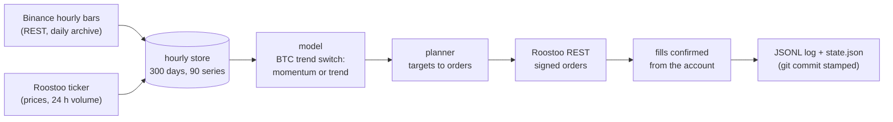

# MiniMax: automated crypto trading bot for the Roostoo APAC Quant Trading Hackathon

Team MiniMax (Pol, Book, Baitoey). The bot trades spot crypto on Roostoo's exchange in competition 538,
**2026-10-04 12:00 UTC to 2026-10-18 12:00 UTC** (20:00 HKT both days), starting from $100,000, with no
leverage and no manual intervention. It runs by itself on one AWS EC2 machine.

## The strategy: `pol_switch_vt_tl_e20v45`

One daily decision at 00:00 HKT (16:00 UTC), choosing between two methods by BTC's trend:

- **BTC in an uptrend** (above its 20-day exponential average by more than 3%; a 3% band against flip-flopping):
  **volume-timed momentum**. Hold the 6 coins with the strongest 7- and 14-day risk-adjusted momentum, keep a
  holding while it stays in the top 12, skip a coin for a day after it breaks its 24-hour low on heavy volume, and
  scale the book so its estimated daily volatility is at most 4.5%.
- **Otherwise: per-coin trend**, long coins in clear up-trends and (when the exchange allows it) short clear
  down-trends, inverse-volatility weights, the book scaled to a volatility target, never above 100% gross.

Every day at 12:00 HKT, if the day has no trade yet, the bot rebalances back to its target weights, so every day
has at least one trade that follows the strategy. If the exchange refuses short positions, the bot continues
long-only by itself; over the backtest the long-only version scores the same.

**End-of-round lock-in.** From day 10 of the round, once the account is 3% above its starting value, the bot sells
everything and holds cash to the end; a small daily trade keeps every day active. This protects a lead against a late
reversal and improves the risk score (the second stage of the ranking). It costs about 0.9% of average return, and in
a strong rally it gives up further gains (`live.endgame`, `reports/review/20261003-flaws.md`).

### Risk and position sizing

- **No leverage.** Longs are bought only with free cash and 1% of equity always stays in USD; a short is 1x and
  fully backed by its own collateral. Total exposure never exceeds 100% of equity.
- **Volatility caps.** In the momentum state the book is scaled down whenever its estimated daily volatility
  (30-day, assuming the coins move together) would exceed 4.5%. In the trend state, coins get inverse-volatility weights
  and the book targets 35% annualised volatility. The rest stays in cash.
- **Concentration.** At most 6 coins in the momentum state (equal weights) and at most 15 in the trend state.
- **Exits.** A momentum holding leaves when it drops out of the top 12, or for a day after it breaks its
  24-hour low on 1.5x its usual volume. A trend position leaves when its trend signal fades.
- **Turnover.** A daily decision, trading only differences beyond a band, plus one small rebalance a day.
  Market orders cost 0.1%.
- **Operational.** Every fill is confirmed from the account, not from the order reply. Orders respect Roostoo's
  precision and minimums and are spaced 3 s apart (at most 20 API calls a minute). An hour that fails is
  logged and retried. The bot keeps Roostoo's server clock.

### How the bot works



Every hour (`src/live/runner.py`):
1. Top up the bars.
2. Read quotes and the account.
3. At 16:00 UTC, run the model on exactly the data a backtest would see.
4. Turn its target weights into orders and send them.
5. Confirm the fills from the account.
6. Log and save the state.

Code: `src/models/pol/pol_switch_vt_tl_e20v45.py` (the switch), `src/models/baitoey/baitoey_vt_mom.py` (momentum),
`src/models/pol/pol_trend_ls.py` (trend), shared logic in `src/models/pol/_combo.py`; every number in
`config.yaml` under `models:`.

## How it was chosen

- **Data:** Binance public hourly data (data.binance.vision and Binance's REST API), the same prices Roostoo uses
  (checked: Roostoo's quotes equal Binance's).
- **Test:** each candidate replayed on 2,298 fourteen-day windows (one per day, June 2020 to September 2026), from
  $100,000, with Roostoo's fees, bid-ask spreads and a one-hour fill delay, using only information available at each
  decision (an automatic leakage check perturbs future prices).
- **Score (return first, like the competition):** how often a model's 14-day return clears three bars (do not lose
  more than last season's #20 team in falling markets, do not lose money, beat the median of six simple benchmark
  strategies), weighted towards periods that look like the current market and recent ones; the competition's risk
  ratios (Sortino, Sharpe, Calmar) as the tie-break. Definitions: `docs/EVALUATION.md`.
- **Evidence:** `reports/review/20261002-e20v45-readiness.md` (the live bot's code replayed hour by hour: every
  function and every rule), `20261002-recheck.md` (robustness), `20261002-selection-rule.md` (how the pick is made).

### Backtest results

| | Result |
|---|---|
| 2,298 fourteen-day windows (2020 to 2026): headline score (share of windows clearing the three bars, weighted) | **0.568** (long-only: 0.575) |
| Mean 14-day return / worst 14-day window | +4.8% / -26.2% |
| Last season's Round 1 dates (2026-03-21 to 03-31, falling market), replayed on the live bot's code | **+3.6%** (that round's real #20 team: about -1.5%) |
| Last season's Final dates (2026-04-04 to 04-14, a rising turn), same replay | +0.3% (real #5 team: +4.6%) |

The replays send every order through the live code, with Roostoo's real pair rules, spreads and fees: 0 errors,
0 rejected orders, a trade on every day.

## Known limitations and assumptions

- **Late at turning points.** The switch follows a 20-day average with a 3% band, so it changes state days
  after a turn. On last season's Final dates (a turn up) it barely made money.
- **Momentum crashes.** The worst fourteen-day window in six years lost 26%. The volatility cap shrinks the book in
  turbulent markets, but there is no portfolio-level stop-loss.
- **Chosen after looking.** The 20-day average and the 4.5% cap came out of a sensitivity study. Neighbouring
  values score about the same (a plateau, `reports/review/20261002-recheck.md`), but the pick was made with the
  results in view.
- **Data.** Roostoo publishes no candles. The bars come from Binance, whose prices Roostoo's quotes match
  (checked). If Binance's API is unreachable, the bot fills the hour from Binance's daily archive and Roostoo's
  ticker.
- **Execution.** Market orders filled at the quoted price with a 0.1% fee on the test account. Market impact on
  large orders is not modelled beyond the bid-ask spread. The backtest fills one hour after the decision; the live
  bot trades within a minute, so the backtest is the conservative side.
- **Lock-in.** Holding cash from day 10 once up 3% gives up any further rally. In rising markets in the backtest,
  that lowers the chance of clearing a high top-20 bar a little (falling markets gain much more).
- **Shorts.** Verified on the test account (open, list, close). If the competition account refuses them, the bot
  continues long-only, which scores the same in the backtest.

## Competition rules the bot follows

No leverage (positions only from free cash; shorts are 1x and collateral-based) · at least one trade every day ·
at most 20 API calls a minute (the limit is 30) · one decision a day plus a daily rebalance (no high-frequency
trading, market-making or arbitrage) · orders at or above the exchange's minimum and precision · no manual trading:
changes only through commits.

## Repository layout

| Path | What is there |
|---|---|
| `src/models/` | Every strategy (`pol/`, `baitoey/`, `book/`, team baselines in `baselines/`); `src/contracts.py` is the interface |
| `src/live/` | The live bot: hourly runner, data feed, broker, self-checks (`runner.py`, `feed.py`, `broker.py`, `selfcheck.py`, `fillcheck.py`) |
| `src/api/` | Roostoo REST client (signing, rate limit, order rules) |
| `src/execution/` | Order planner and paper broker |
| `src/data/`, `src/validation/` | Binance downloader and loaders; the research panel and market-likeness weights |
| `backtest/` | Backtest engine and the competition-style scoring (`backtest/scoring/`) |
| `deploy/` | EC2 setup script, systemd service, pinned packages, the bot's starting price history (`deploy/seed/`) |
| `docs/`, `reports/` | Methods, evaluation rules, every scored model's report and the team's reviews |
| `config.yaml` | All settings: universe, harness, scoring, models, the live bot (`live:`) |

## Running it

Python 3.10 or newer.

```bash
python3 -m venv .venv && source .venv/bin/activate
pip install -r deploy/requirements-lock.txt pytest
pytest -q                                              # the test suite (no network, no keys)
python -m src.live.runner run --mode paper --once      # one hour of the bot with paper money (needs data/live, see deploy/)
```

Backtests need the Binance data in `data/` (`python -m src.data.binance_downloader`, then `python -m src.validation.build`);
then `python -m backtest.run --model pol_switch_vt_tl_e20v45 --score`.

**Deployment on AWS EC2** (Session Manager only, one instance, systemd): `deploy/README.md`. In short: clone into
`/opt/minimax`, run `bash deploy/setup_ec2.sh` (Python 3.11 on Amazon Linux, packages, time sync, seed, service),
check the clock (`python -m src.live.runner clock` must print `RESULT OK`), start `minimax-bot`. For the round,
`bash deploy/go_live_round.sh` asks for the competition key and switches the bot over in one step;
`bash deploy/status.sh` shows how it is doing (read-only). `live.mode` and `live.model` in `config.yaml` decide what
runs; the bot only trades from `live.start_at`.

## Keys

API keys live only in `.env` on the machine that runs the bot (gitignored, `chmod 600`); `.env.example` shows the
three lines. They are never printed, logged or committed. The competition key is refused anywhere except under the
EC2 service.

## Licence

MIT (`LICENSE`).

## Team process

`AGENTS.md`: every member works in a separate git worktree; a change reaches `main` only after another member's
review; model results are pre-registered before they are scored.
