# baitoey_rot_max: competition-style score

ROT_EW rotation fully invested (no vol cap), top k equal weights; optional BTC 20-day-average gate

| | |
|---|---|
| Method · author | momentum · baitoey |
| Code | commit `8e3a29398d94` · run key `b5975af3f413d4fd` · tool version `56cb5a2e85d45862` (scoring v1) |
| Windows | 2245 scored (stride 1 day), starts 2020-06-01 → 2026-07-25; holdout sealed from 2026-08-08T16:00 UTC |
| Weights | live-like: `validation/live_like_v1.json` (effective n 991) · recency: half-life 60 d to T* 2026-10-03 16:00 (effective n 173) · split 70% / 30% |
| Data | panel to 2026-09-30 00:00 UTC · universe `roostoo` · spreads ticker_20260928T174533Z.json |
| Outputs | `results/book/20261001-scoring/baitoey_rot_max-20261001-1329/score.json` (sha256 `3f7ae72334a92f5d…`) · `results/book/20261001-scoring/baitoey_rot_max-20261001-1329/trades.csv.gz` |
| Runtime | 41 s (cached parts are reused) |

## Summary

**HEADLINE REL FLOORED (primary): +2.061** (1.00 = the field average under all four readings), rank 2 of 10 scored runs · **NOT eligible** (fails G2, G3, G6).

Robustness (REL per layer, 1.00 = field average there): headline +2.061 · live_like +2.066 · recency +2.051 · flat +2.089 → **robust** (launch rule: every layer >= 1.00). Return bar: the field's max; REL under the median bar +1.345.

Median 14-day R +0.65% · worst 10% -18.05% · worst fortnight -49.10% · median MDD 14.53% (liquidated median R +0.55%).

| Variant | FLOORED | rank | POL | rank | Live-like layer | Recency layer |
|---|---|---|---|---|---|---|
| V1 daily_raw | +0.063 | 2/10 | +0.063 | 3/10 | +0.063 | +0.062 |
| V2 daily_annual | +3.008 | 2/10 | +3.008 | 3/10 | +3.010 | +3.005 |
| V3 hourly_annual | +2.770 | 2/10 | +2.770 | 2/10 | +2.742 | +2.836 |
| V4 total_calmar | +0.130 | 2/10 | +0.130 | 3/10 | +0.131 | +0.128 |
| REL field-relative (1.00 = field average, V1–V4 averaged) (primary) | +2.061 | 2/10 | +2.061 | 3/10 | +2.062 | +2.059 |

Layers use the FLOORED convention. Ranks are among the full runs in the registry with this tool version (identical results counted once).

### Gates

| Gate | Result | Detail |
|---|---|---|
| G1 activity | PASS | 100.0% of 2245 windows have >= 10 active days (need 100%); worst 14 · **flag: 64% of active days come only from the guard** |
| G2 worst fortnight | **FAIL** | worst 14-day R -49.10% vs BTC_HOLD -42.18% (must be higher) |
| G3 regimes | **FAIL** | cells below -10%: down/midvol -12.1%, down/highvol -14.3% |
| G4 shorts disabled | PASS | no shorts: the long-only run is the main run |
| G5 leakage | PASS | 30 decisions: reproducible, unchanged under future noise, no I/O |
| G6 STRESS survival | **FAIL** | STRESS (n=20): worst -49.10% vs BTC_HOLD -42.18%, median +15.85% vs -0.67% (both must be >=) |

### Layer scores (REL FLOORED)

| Layer | Role | n | CS | Median R | Worst 10% | Worst | Gate passed |
|---|---|---|---|---|---|---|---|
| LIVE-LIKE | 70% of HEADLINE, weighted | 2245 (effective 991) | +2.062 | -1.85% | -15.15% | -49.10% | 22% |
| RECENCY | 30% of HEADLINE, weighted | 2245 (effective 173) | +2.059 | -0.11% | -10.24% | -49.10% | 29% |
| ALL_flat | report only, flat mean | 2245 | +3.640 | +0.65% | -18.05% | -49.10% | 23% |
| RECENT25 | report only | 25 | +2.847 | -2.31% | -17.47% | -25.77% | 32% |
| LOOKALIKE25 | report only | 25 | +6.198 | +1.13% | -20.05% | -24.63% | 28% |
| STRESS | gate G6 only | 20 | +2.912 | +15.85% | -34.20% | -49.10% | 10% |

### Comparison with the benchmarks (same windows, same field median and weights)

| Model | HEADLINE REL FLOORED | REL POL | Median R | Worst 10% | Worst | Median MDD | STRESS worst | Min active days |
|---|---|---|---|---|---|---|---|---|
| **baitoey_rot_max** | **+2.061** | +2.061 | +0.65% | -18.05% | -49.10% | 14.53% | -49.10% | 14 |
| BTC_HOLD | +1.553 | +1.553 | +0.63% | -11.31% | -42.18% | 8.71% | -42.18% | 14 |
| EW_DAILY | +1.416 | +1.416 | -0.12% | -17.07% | -54.65% | 13.91% | -54.65% | 14 |
| ROT_EW | +1.666 | +1.666 | +0.48% | -12.28% | -33.60% | 10.38% | -33.60% | 14 |
| ROT_IV | +0.061 | +0.061 | +0.45% | -8.61% | -24.03% | 7.04% | -24.03% | 14 |
| TREND_2 | +0.223 | +0.223 | -0.16% | -6.68% | -17.86% | 5.27% | -14.43% | 14 |
| MOM_SS25 | +1.082 | +1.082 | +0.02% | -5.96% | -14.36% | 4.72% | -10.33% | 14 |

## Activity, exposure, costs

| Min / median active days | Guard-only share of active days | Fees / E_0 | Spread / E_0 | Turnover | Mean gross | Max gross | Mean net | Orders / window | Most orders in one decision |
|---|---|---|---|---|---|---|---|---|---|
| 14 / 14 | 64.2% | 0.36% | 0.05% | 3.64 | 100% | 100% | +100% | 69 | 6 |

Means over the scored windows. Orders follow the shared planner's rules (a long-to-short flip is two orders); each decision also needs the bot's balance and price queries, which are not counted here.

## Floor hits (windows where a floor set the denominator)

| Convention | s daily | dd daily | s hourly | dd hourly | MDD | of windows |
|---|---|---|---|---|---|---|
| FLOORED | 0 | 3 | 0 | 0 | 0 | 2245 |
| POL | 0 | 1 | 0 | 0 | 0 | 2245 |

POL has no s or dd floor: its column counts zero denominators, where the ratio is set to 0.

## Charts

**Top-25 live-like windows: equity path vs BTC_HOLD and the field median, by weight**

**Weighted distribution of the 14-day return R**

**Weighted distribution of the max drawdown**

**STRESS windows: the model's R vs BTC_HOLD's**

**Median R in each cell of the 3x3 regime grid**

**Gross and net exposure by hour of the window**

**Cumulative fees and spread through the window**

**Active days: strategy trades vs the engine's daily-trade guard**

## Formulas

Per window (14 days from cash, hourly equity E_0..E_336 from the harness engine; E_0 = 100,000 before the first trade):

- daily equity D_d = E_(24d), d = 0..14; daily returns r_d = D_d / D_(d-1) - 1 (14 values); hourly returns h_k = E_k / E_(k-1) - 1 (336 values)
- R = E_336 / E_0 - 1 (mark-to-market, primary); R_liq = (E_336 - 0.001 x gross notional at the end) / E_0 - 1
- MDD = max over k of (1 - E_k / max_(j<=k) E_j), including E_0
- for a series x of length n: m = mean, s = sqrt(sum((x - m)^2) / (n - 1)), dd = sqrt(sum(min(x, 0)^2) / n); Sharpe = m / s, Sortino = m / dd (risk-free 0); a ratio is 0 when m = 0
- V1 daily_raw: Sharpe = m/s, Sortino = m/dd, Calmar = m / MDD (daily r) · V2 daily_annual: (m/s)·√365, (m/dd)·√365, (m·365) / MDD · V3 hourly_annual (hourly h): (m/s)·√8760, (m/dd)·√8760, (m·8760) / MDD · V4 total_calmar: Sharpe and Sortino as V1, Calmar = R / MDD
- Composite = 0.4 Sortino + 0.3 Sharpe + 0.3 Calmar
- FLOORED: s and dd floored at 0.001 (daily) and 0.000204124 = 0.001/√24 (hourly), MDD floored at 0.002 in Calmar · POL: MDD floored at 0.0001, s and dd unfloored, a zero denominator gives 0 (backtest/metrics.py)

Across windows:

- return gate: gate_w = 1 if R_w >= max(0.0, bar_w), bar_w = the max of the 6 benchmarks' R_w that window (about 150 teams in the region, top 20 = top 13%), else 0 · CS_w = gate_w x Composite_w
- LIVE-LIKE weights from `validation/live_like_v1.json` (PART 0), renormalized over the scored windows · RECENCY weight = 0.5^(age / 60), age = days from the window's end to T* = 2026-10-03 16:00
- HEADLINE = 0.7 x (sum w_live CS / sum w_live) + 0.3 x (sum w_rec CS / sum w_rec)
- REL: CS_w(REL) = mean over V1–V4 of CS_w(v) / F(v), F(v) = the 6 benchmarks' mean HEADLINE(v); so HEADLINE(REL) = mean over v of HEADLINE(v) / F(v), and 1.00 is the field average
- Gates: G1 >= 10 active days in 100% of windows (guard days count; flagged above 25% of active days) · G2 worst R > BTC_HOLD's worst · G3 no regime cell median R < -10% · G4 long-only run (negative targets set to 0) completes and passes G1 and G2 · G5 30 decisions: reproducible, unchanged when all data after t is random-walk noise, no I/O · G6 STRESS worst R >= BTC_HOLD's worst and median R >= BTC_HOLD's median

Every setting is pending team review: docs/EVALUATION.md, TEAM SIGN-OFF CHECKLIST.
