# pol_switch_rc: competition-style score (return first)

BTC in trend: momentum rotation; out of trend: cash

| | |
|---|---|
| Method · author | selector · pol · candidate |
| Code | commit `b47e309a9c8e` · run key `c335e2ea4e20513c` · tool version `3036a0d8bfdaa6a0` (scoring v2) |
| Windows | 2298 scored, starts 2020-06-01T12:00 → 2026-09-15T12:00 UTC, every day at 12:00 UTC; 52 end after the spent holdout date 2026-08-08T16:00 UTC (included: True) |
| Weights | LL `validation/live_like_v2_prelim.json` (effective n 601) · recency half-life 60 d from 2026-09-15 12:00 · split 70% / 30% · pi_up 0.543 · effective n of w' 501 |
| Data | panel to 2026-09-30 00:00 UTC · universe `roostoo` · spreads ticker_20260928T174533Z.json |
| Outputs | `results/book/20261001-scoring/pol_switch_rc-20261001-1822/score.json` (sha256 `6b842d0ac9547a3c…`) · `results/book/20261001-scoring/pol_switch_rc-20261001-1822/trades.csv.gz` |
| Runtime | 102 s (cached parts are reused) |

## Summary

**HEADLINE_RET 0.443** (primary; rank 8 of 10 registered runs of this tool version) · without the post-holdout windows **0.373** · **eligible** (hard gates pass).

CS_HIT (risk second: mean V1 FLOORED composite on HKT days over the windows clearing LENIENT) **0.247**, on UTC days 0.233. Pol's period check (REL on the field-best bar): SCREEN +0.855, CONFIRM +0.498.

| Pool | HEADLINE_RET | HIT LENIENT | HIT MIDDLE | HIT STRICT | UP windows (L / M / S) | DOWN windows (L / M / S) | Pol's bars q67 / q83 / best | HEADLINE_RET on plain R | CS_HIT | pi_up |
|---|---|---|---|---|---|---|---|---|---|---|
| full (2298) | **0.443** | 0.577 | 0.446 | 0.306 | 0.61 / 0.61 / 0.38 | 0.53 / 0.25 / 0.22 | 0.24 / 0.13 / 0.07 | 0.446 | 0.247 | 0.543 |
| without post-holdout (2246) | **0.373** | 0.526 | 0.363 | 0.231 | 0.53 / 0.53 / 0.30 | 0.52 / 0.17 / 0.15 | 0.19 / 0.13 / 0.08 | 0.377 | 0.218 | 0.539 |

Benchmarks on the same windows, bars and weights (HEADLINE_RET full / without post-holdout): BTC_HOLD 0.478 / 0.491 · EW_DAILY 0.468 / 0.444 · ROT_EW 0.547 / 0.507 · ROT_IV 0.511 / 0.456 · TREND_2 0.449 / 0.423 · MOM_SS25 0.458 / 0.430.

### Gates

| Gate | Kind | Result | Detail |
|---|---|---|---|
| G1 activity | hard | PASS | 100.0% of 2298 windows have >= 10 active HKT days (need 100%); worst 15 of 15; UTC days: worst 15, 100.0% of windows >= 10 · guard-only days 6.4% of active days |
| G2 worst fortnight | report-only | PASS | worst 14-day R -21.80% vs BTC_HOLD -37.32% (must be higher) |
| G3 regimes | report-only | PASS | lowest cell median -4.73% (limit -10%) |
| G4 shorts disabled | hard | PASS | no shorts: the long-only run is the main run |
| G5 leakage | hard | PASS | 30 decisions: reproducible, unchanged under future noise, no I/O |
| G6_median STRESS, median-of-20 | report-only | PASS | STRESS (n=20): worst -18.66% vs BTC_HOLD -37.32%, median +1.83% vs +0.74% (both must be >=) |
| G6_worst STRESS, worst-of-20 | report-only | PASS | STRESS (n=20): worst -18.66% vs BTC_HOLD -37.32% (must be >=) |

### Tail (plain R, report-only)

| Pool | Worst R | 5th percentile R | Median MDD | p90 MDD | STRESS crashes, median R | STRESS rebounds, median R |
|---|---|---|---|---|---|---|
| full | -21.80% | -12.25% | 7.69% | 15.33% | -0.42% | +7.84% |
| in_sample | -21.80% | -12.15% | 7.50% | 15.07% | -0.42% | +9.27% |

### Previous edition's real windows (report-only, numbers only)

| Window | R | Max drawdown | Rank among the real teams |
|---|---|---|---|
| Round 1 (Mar 21-31) | -0.02% | 0.45% | #13 of 47 (competition 455), #10 of 55 (competition 456) |
| Final (Apr 4-14) | +5.22% | 5.21% | #4 of 16 (competition 469) |

### Report-only: the previous primary on these windows

REL (field-best bar, FLOORED): +0.514 · robustness min layer +0.210 (not robust). Not comparable with the REL of earlier tool versions (other windows and weights).

Median 14-day R -0.01% · worst 10% -9.38% · worst fortnight -21.80% · median R_liq -0.01%.

## Activity, exposure, costs

| Min / median active HKT days | Min active UTC days | Guard-only share (HKT / UTC) | Fees / E_0 | Spread / E_0 | Turnover | Mean gross | Max gross | Mean net | Orders / window | Most orders in one decision |
|---|---|---|---|---|---|---|---|---|---|---|
| 15 / 15 of 15 | 15 of 15 | 6.4% / 11.8% | 0.37% | 0.05% | 3.68 | 42% | 100% | +42% | 87 | 11 |

First decisions at the window start: 4596 model calls in all; 0 windows where they never rejoined the shared decisions.

## Floor hits (windows where a floor set the denominator)

| Convention | s daily | dd daily | s hourly | dd hourly | MDD | of windows |
|---|---|---|---|---|---|---|
| FLOORED | 665 | 687 | 660 | 661 | 660 | 2298 |
| POL | 0 | 0 | 0 | 0 | 66 | 2298 |

## Charts

**Top-25 windows by final weight: equity path vs BTC_HOLD and the field median**

**Weighted distribution of the 14-day return R**

**Weighted distribution of the max drawdown**

**STRESS windows: the model's R vs BTC_HOLD's**

**Median R in each cell of the 3x3 regime grid**

**Gross and net exposure by hour of the window**

**Cumulative fees and spread through the window**

**Active days: strategy trades vs the engine's daily-trade guard**

## Formulas

Per window (14 days from cash, starting at 12:00 UTC like the round; hourly equity E_0..E_336 from the harness engine, which makes the model's first decision at the window start; E_0 = 100,000 before the first trade):

- R = E_336 / E_0 - 1 (mark-to-market); **R_liq** = (E_336 - 0.001 x gross notional at the end) / E_0 - 1, what is left after the system liquidates at the end
- HKT days: boundaries at the start, every 16:00 UTC inside the window and the end (15 daily returns for a 12:00 UTC start, the first 4 h and the last 20 h); UTC days the same with 00:00 UTC (12 h, 13 x 24 h, 12 h). A fill at time t belongs to the day containing t
- MDD = max over k of (1 - E_k / max_(j<=k) E_j), including E_0
- for a series x of length n: m = mean, s = sqrt(sum((x - m)^2) / (n - 1)), dd = sqrt(sum(min(x, 0)^2) / n); Sharpe = m / s, Sortino = m / dd (risk-free 0); a ratio is 0 when m = 0
- V1 daily_raw: Sharpe = m/s, Sortino = m/dd, Calmar = m / MDD (daily r) · V2 daily_annual: (m/s)·√365, (m/dd)·√365, (m·365) / MDD · V3 hourly_annual (hourly h): (m/s)·√8760, (m/dd)·√8760, (m·8760) / MDD · V4 total_calmar: Sharpe and Sortino as V1, Calmar = R / MDD
- Composite = 0.4 Sortino + 0.3 Sharpe + 0.3 Calmar · FLOORED: s and dd floored at 0.001 (daily) and 0.000204124 (hourly), MDD at 0.002 · POL: MDD floored at 0.0001, s and dd unfloored, a zero denominator gives 0

Across windows:

- weights: LL from `validation/live_like_v2_prelim.json` (PART 0's method), REC = 0.5^(age / 60 d), age = days from the start to the latest start; w = 0.7 LL / sum LL + 0.3 REC / sum REC; a window is UP if BTC's close at its end >= at its start; w' = w x pi_up / sum_UP w (UP) or w x (1 - pi_up) / sum_DOWN w (DOWN), pi_up = the unweighted share of UP windows
- bars on R_liq: LENIENT = -1.4965215% in DOWN windows (the previous edition's #20 cut), +0.0% in UP windows (ASSUMPTION) · MIDDLE = +0.0% · STRICT = max(0%, median R_liq of the 6 gate benchmarks)
- HIT_b = sum of w' over windows with R_liq >= bar_b · **HEADLINE_RET = (HIT_LENIENT + HIT_MIDDLE + HIT_STRICT) / 3**
- CS_HIT = sum of w' x composite (V1 FLOORED, HKT days) over the windows clearing LENIENT / their sum of w' (0 if none)
- hard gates: G1 >= 10 active HKT days in 100% of windows · G4 the long-only run completes cleanly · G5 30 decisions reproducible, unchanged under future noise, no I/O
- report-only gates: G2 worst R > BTC_HOLD's worst · G3 no regime cell median R < -10% · G6_median STRESS worst >= BTC_HOLD's and median >= BTC_HOLD's · G6_worst STRESS worst >= BTC_HOLD's

Every setting is pending team review: docs/EVALUATION.md, TEAM SIGN-OFF CHECKLIST.
