# team_ew_daily: competition-style score

Equal weights across the point-in-time universe, rebalanced daily (scoring field)

| | |
|---|---|
| Method · author | reference · team |
| Code | commit `b5e21eeee844` · run key `afdf98200e4de118` · tool version `c0f83aa56ae994e9` (scoring v1) |
| Windows | 2245 scored (stride 1 day), starts 2020-06-01 → 2026-07-25; holdout sealed from 2026-08-08T16:00 UTC |
| Weights | live-like: `validation/live_like_v1.json` (effective n 991) · recency: half-life 60 d to T* 2026-10-03 16:00 (effective n 173) · split 70% / 30% |
| Data | panel to 2026-09-30 00:00 UTC · universe `roostoo` · spreads ticker_20260928T174533Z.json |
| Outputs | `results/book/20261001-scoring/team_ew_daily-20261001-0219/score.json` (sha256 `15c143084bac2fae…`) · `results/book/20261001-scoring/team_ew_daily-20261001-0219/trades.csv.gz` |
| Runtime | 7 s (cached parts are reused) |

## Summary

**HEADLINE V1 FLOORED (primary): +0.074**, rank 2 of 3 scored runs · **NOT eligible** (fails G2, G3, G6).

Median 14-day R -0.04% · worst 10% -17.04% · worst fortnight -54.73% · median MDD 13.92% (liquidated median R -0.14%).

| Variant | FLOORED | rank | POL | rank | Live-like layer | Recency layer |
|---|---|---|---|---|---|---|
| V1 daily_raw (primary) | +0.074 | 2/3 | +0.075 | 2/3 | +0.084 | +0.053 |
| V2 daily_annual | +3.611 | 2/3 | +3.611 | 2/3 | +4.031 | +2.630 |
| V3 hourly_annual | +3.287 | 2/3 | +3.287 | 2/3 | +3.638 | +2.469 |
| V4 total_calmar | +0.156 | 2/3 | +0.156 | 2/3 | +0.175 | +0.112 |

Layers use the FLOORED convention. Ranks are among the full runs in the registry with this tool version (identical results counted once).

### Gates

| Gate | Result | Detail |
|---|---|---|
| G1 activity | PASS | 100.0% of 2245 windows have >= 10 active days (need 100%); worst 14 · guard-only days 0.0% of active days |
| G2 worst fortnight | **FAIL** | worst 14-day R -54.73% vs BTC_HOLD -42.21% (must be higher) |
| G3 regimes | **FAIL** | cells below -10%: down/midvol -12.5%, down/highvol -13.0% |
| G4 shorts disabled | PASS | no shorts: the long-only run is the main run |
| G5 leakage | PASS | 30 decisions: reproducible, unchanged under future noise, no I/O |
| G6 STRESS survival | **FAIL** | STRESS (n=20): worst -54.73% vs BTC_HOLD -42.21%, median +19.92% vs -0.66% (both must be >=) |

### Layer scores (V1 FLOORED)

| Layer | Role | n | CS | Median R | Worst 10% | Worst | Gate passed |
|---|---|---|---|---|---|---|---|
| LIVE-LIKE | 70% of HEADLINE, weighted | 2245 (effective 991) | +0.084 | -2.52% | -14.80% | -54.73% | 31% |
| RECENCY | 30% of HEADLINE, weighted | 2245 (effective 173) | +0.053 | -2.00% | -13.31% | -54.73% | 28% |
| ALL_flat | report only, flat mean | 2245 | +0.199 | -0.04% | -17.04% | -54.73% | 43% |
| RECENT25 | report only | 25 | +0.044 | -4.77% | -13.58% | -27.12% | 28% |
| LOOKALIKE25 | report only | 25 | +0.234 | +4.62% | -13.51% | -30.19% | 44% |
| STRESS | gate G6 only | 20 | +0.551 | +19.92% | -32.84% | -54.73% | 55% |

### Comparison with the benchmarks (same windows, same field median and weights)

| Model | HEADLINE V1 FLOORED | V1 POL | Median R | Worst 10% | Worst | Median MDD | STRESS worst | Min active days |
|---|---|---|---|---|---|---|---|---|
| **team_ew_daily** | **+0.074** | +0.075 | -0.04% | -17.04% | -54.73% | 13.92% | -54.73% | 14 |
| BTC_HOLD | +0.076 | +0.076 | +0.63% | -11.35% | -42.21% | 8.72% | -42.21% | 1 |
| EW_DAILY | +0.074 | +0.075 | -0.04% | -17.04% | -54.73% | 13.92% | -54.73% | 14 |
| ROT_EW | +0.090 | +0.090 | +0.53% | -12.19% | -34.09% | 10.33% | -34.09% | 14 |
| ROT_IV | +0.059 | +0.059 | +0.50% | -8.17% | -24.54% | 7.08% | -24.54% | 14 |
| TREND_2 | +0.046 | +0.046 | -0.14% | -6.59% | -17.94% | 5.31% | -14.40% | 14 |
| MOM_SS25 | +0.064 | +0.064 | +0.05% | -5.91% | -15.32% | 4.92% | -10.04% | 14 |

## Activity, exposure, costs

| Min / median active days | Guard-only share of active days | Fees / E_0 | Spread / E_0 | Turnover | Mean gross | Max gross | Mean net | Orders / window | Most orders in one decision |
|---|---|---|---|---|---|---|---|---|---|
| 14 / 14 | 0.0% | 0.15% | 0.02% | 1.50 | 100% | 100% | +100% | 306 | 32 |

Means over the scored windows. Orders follow the shared planner's rules (a long-to-short flip is two orders); each decision also needs the bot's balance and price queries, which are not counted here.

## Floor hits (windows where a floor set the denominator)

| Convention | s daily | dd daily | s hourly | dd hourly | MDD | of windows |
|---|---|---|---|---|---|---|
| FLOORED | 0 | 2 | 0 | 0 | 0 | 2245 |
| POL | 0 | 0 | 0 | 0 | 0 | 2245 |

POL has no s or dd floor: its column counts zero denominators, where the ratio is set to 0.

## Charts

**Top-25 live-like windows: equity path vs BTC_HOLD and the field median, by weight**

**Weighted distribution of the 14-day return R**

**Weighted distribution of the max drawdown**

**STRESS windows: the model's R vs BTC_HOLD's**

**Median R in each cell of the 3x3 regime grid**

**Gross and net exposure by hour of the window**

**Cumulative fees and spread through the window**

**Active days: strategy trades vs the engine's daily-trade guard**

## Formulas

Per window (14 days from cash, hourly equity E_0..E_336 from the harness engine; E_0 = 100,000 before the first trade):

- daily equity D_d = E_(24d), d = 0..14; daily returns r_d = D_d / D_(d-1) - 1 (14 values); hourly returns h_k = E_k / E_(k-1) - 1 (336 values)
- R = E_336 / E_0 - 1 (mark-to-market, primary); R_liq = (E_336 - 0.001 x gross notional at the end) / E_0 - 1
- MDD = max over k of (1 - E_k / max_(j<=k) E_j), including E_0
- for a series x of length n: m = mean, s = sqrt(sum((x - m)^2) / (n - 1)), dd = sqrt(sum(min(x, 0)^2) / n); Sharpe = m / s, Sortino = m / dd (risk-free 0); a ratio is 0 when m = 0
- V1 daily_raw: Sharpe = m/s, Sortino = m/dd, Calmar = m / MDD (daily r) · V2 daily_annual: (m/s)·√365, (m/dd)·√365, (m·365) / MDD · V3 hourly_annual (hourly h): (m/s)·√8760, (m/dd)·√8760, (m·8760) / MDD · V4 total_calmar: Sharpe and Sortino as V1, Calmar = R / MDD
- Composite = 0.4 Sortino + 0.3 Sharpe + 0.3 Calmar
- FLOORED: s and dd floored at 0.001 (daily) and 0.000204124 = 0.001/√24 (hourly), MDD floored at 0.002 in Calmar · POL: MDD floored at 0.0001, s and dd unfloored, a zero denominator gives 0 (backtest/metrics.py)

Across windows:

- return gate: gate_w = 1 if R_w >= max(0.0, median of the 6 benchmarks' R_w), else 0 · CS_w = gate_w x Composite_w
- LIVE-LIKE weights from `validation/live_like_v1.json` (PART 0), renormalized over the scored windows · RECENCY weight = 0.5^(age / 60), age = days from the window's end to T* = 2026-10-03 16:00
- HEADLINE = 0.7 x (sum w_live CS / sum w_live) + 0.3 x (sum w_rec CS / sum w_rec)
- Gates: G1 >= 10 active days in 100% of windows (guard days count; flagged above 25% of active days) · G2 worst R > BTC_HOLD's worst · G3 no regime cell median R < -10% · G4 long-only run (negative targets set to 0) completes · G5 30 decisions: reproducible, unchanged when all data after t is random-walk noise, no I/O · G6 STRESS worst R >= BTC_HOLD's worst and median R >= BTC_HOLD's median

Every setting is pending team review: docs/EVALUATION.md, TEAM SIGN-OFF CHECKLIST.
